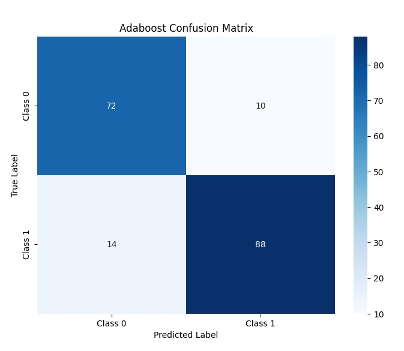

## 5. AdaBoost Ensemble

### 5.1 Algorithm Design
The AdaBoost (Adaptive Boosting) ensemble is implemented in `adaboost.py`, using the Decision Tree class restricted to `max_depth=1` (decision stumps) as weak learners. AdaBoost is a sequential ensemble method that focuses on reducing bias by iteratively correcting the mistakes of previous learners.

**Weight Initialization & Updates**
Sample weights are initialized uniformly ($w_i = 1/N$). After each weak learner $h_t$ is trained, the weighted classification error $\varepsilon_t$ is computed. The learner's contribution weight $\alpha_t$ is calculated as:

$$ \alpha_t = 0.5 \ln\left(\frac{1 - \varepsilon_t}{\varepsilon_t}\right) $$

Misclassified samples have their weights multiplied by $\exp(\alpha_t)$, while correctly classified samples are down-weighted. Weights are re-normalized after each round to maintain a valid probability distribution for the next bootstrap sample.

**Prediction Mechanism**
Final predictions are made via a weighted majority vote across all trained stumps:

$$ H(x) = \text{sign}\left( \sum_t \alpha_t \cdot h_t(x) \right) $$

where $h_t(x) \in \{-1, +1\}$. The sign function maps the aggregated score back to $\{0, 1\}$ class labels.

**Weak Learner Choice**
Decision stumps (`max_depth=1`) are intentionally used as weak learners. Their high bias ensures that boosting has sufficient room to iteratively improve the decision boundary by focusing on hard-to-classify regions, which aligns with AdaBoost's theoretical foundations.

### 5.2 Hyperparameter Tuning
**Validation-Based Early Stopping**
Instead of a traditional grid search over the number of estimators, we employed validation-based early stopping. The model was trained for up to 50 rounds, and the validation F1-score was recorded after each round. The ensemble was truncated at the round that achieved the peak validation performance to prevent overfitting to the training distribution.

**Tuning Results**
*   **Base Learner:** Decision Stump (`max_depth=1`)
*   **Max Rounds:** 50
*   **Best Configuration:** 49 estimators (selected at peak validation F1 = 0.9259)

The validation F1 curve shows rapid improvement in the first 15 rounds, followed by gradual refinement as the algorithm focuses on increasingly difficult edge cases. Stopping at 49 estimators ensured the model captured complex patterns without memorizing noise in the 642-sample training set.

### 5.3 Test Set Results
The AdaBoost ensemble was evaluated on the held-out test set of 184 samples using the configuration selected during validation.

| Metric   | Score  |
| -------- | ------ |
| Accuracy | 0.8641 |
| F1-Score | 0.8731 |

**Confusion Matrix**
|               | Pred: No HF | Pred: HF |
| ------------- | ----------- | -------- |
| Actual: No HF | 73 (TN)     | 9 (FP)   |
| Actual: HF    | 16 (FN)     | 86 (TP)  |

**Clinical & Performance Analysis**
AdaBoost achieves the highest test F1-score (0.8731) and accuracy (0.8641) among all models evaluated in this report. Notably, it produces only 9 false positives, the lowest among all classifiers, indicating high precision in identifying healthy patients. The 16 false negatives represent a moderate miss rate, but the overall balance between precision and recall is superior to the single Decision Tree and Bagging ensemble. The sequential weight-update mechanism effectively forced the ensemble to learn a robust boundary for the positive class without sacrificing specificity.